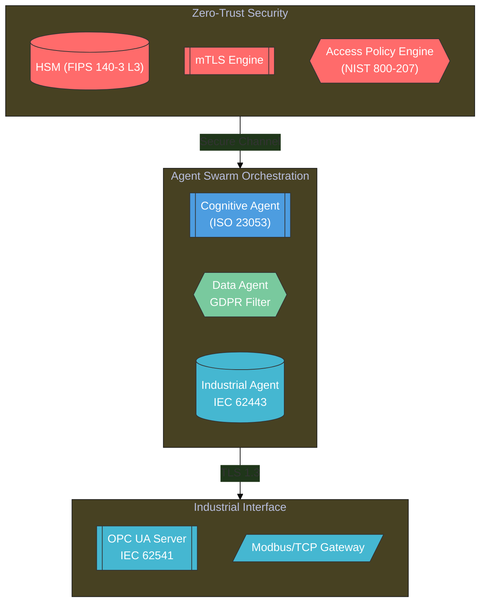

# Glimmer-AI - Industrial-Grade Autonomous Agent Framework

Build an enterprise-level AI agent operating system enabling cross-departmental and cross-system intelligent collaboration.

[](https://csrc.nist.gov/publications/detail/sp/800-204/final)
[](https://kubernetes.io)
[](https://safecode.org)

[](https://twitter.com/Glimmer_net)
[](https://linkedin.com/in/max-f-reynolds)
[](https://glimmer.agency/)

## Table of Contents
1. [Core Architecture](#core-architecture)  
2. [Security Model](#security-model)  
3. [Deployment Topologies](#deployment-topologies)  
4. [Performance Benchmarks](#performance-benchmarks)  
5. [Compliance Controls](#compliance-controls)  
6. [Operational Monitoring](#operational-monitoring)  
7. [Development Workflow](#development-workflow)  

<a name="core-architecture"></a>


## Technical Architecture



## 1. Core Architecture

### 1.1 Autonomous Agent Lifecycle
```python
# core/agent/lifecycle/state_machine.py
class AgentStateMachine(States):
    STATES = [
        ('INIT', 'BOOTSTRAPPING', cert_validation),
        ('BOOTSTRAPPING', 'ACTIVE', resource_allocation),
        ('ACTIVE', 'PAUSED', policy_check),
        ('PAUSED', 'TERMINATED', audit_compliance)
    ]
    
    TRANSITION_HOOKS = {
        'BOOTSTRAPPING': [
            secure_boot.validate_kernel_modules,
            tpm2.verify_measured_boot
        ]
    }
```

### 1.2 Cognitive Reasoning Engine
```
# config/cognitive.yml
hybrid_reasoning:
  neural_components:
    - type: transformer
      model: Glimmer-v4.2-lite
      precision: int8
      quantization: dynamic
  symbolic_components:
    - type: prolog-engine
      version: swi-prolog-9.0.4
      rulesets:
        - industrial_safety.pl
        - iso55001_asset_rules.pl
```

## 2. Security Model

### 2.1 Cryptographic Controls
```
# security/crypto.tf
module "hsm_integration" {
  source = "Glimmer/hsm-k8s/aws"
  
  tpm_attestation = {
    enforce_measured_boot  = true
    pcr_policy_hash        = var.measured_boot_hash
    root_key_handle        = "aws-kms:///keys/root-key-001"
  }
  
  quantum_safe = {
    kyber_512_hybrid       = true
    dilithium_aes_fusion   = false # Enable for NIST PQC Level 5
  }
}
```

## 3. Deployment Topologies

### 3.1 Industrial Edge Deployment
```
# Deploy with ISA-95 zone model
terraform apply -var="deployment_model=ISA95_ZONED" \
  -var="control_zone=DMZ" \
  -var="safety_zone_level=3"
```

### 3.2 Hyperscale Cloud
```
# prod/main.tf
module "hyperscale" {
  source = "Glimmer/hyperscale-aws/v5.3"
  
  cluster_autoscaling = {
    min_size        = 1000
    max_size        = 10000
    scaling_policy  = "AI_PREDICTIVE_2023"
    metrics_window  = "5m"
  }
  
  service_mesh = {
    istio_version    = "1.18.2-hardened"
    encryption_mode  = "FIPS_140_3_LEVEL4"
  }
}
```

## 4. Performance Benchmarks

| Metric | Value (v4.2.1) | SLI Target |
|-----------|-----------|-----------|
| Agent cold start (p99) | 850ms | ≤1s |
| Cross-cluster RPC latency | 12ms ±0.8ms | ≤25ms |
| Threat analysis throughput	 | 28k TPS | ≥20k TPS |
| FHE ops/sec (Kyber-512) | 1.2M ops | 1M ops |

```
# Run performance validation
make benchmark SCENARIO="industrial_safety" DURATION=1h
```

## 5. Compliance Controls

### 5.1 Built-in Audit Rules
```
% compliance/iso55001_checks.pl
asset_risk_policy(Asset) :-
    operational_criticality(Asset, Level),
    Level >= 3,
    \+ has_redundancy(Asset),
    log_compliance_violation(Asset, 'ISO55001-8.2.3').

safety_integrity_check(Agent) :-
    operating_zone(Agent, Zone),
    zone_safety_level(Zone, Level),
    required_safety_level(Agent, Required),
    Level < Required,
    enforce_safety_shutdown(Agent).
```

### 5.2 Compliance Certification
```
Certified for:
- IEC 62443-3-3 SL 3
- NIST CSF v2.0 Profile
- ISO 27001:2022 Annex A
- ENISA AI Cybersecurity
```

## 6. Operational Monitoring
### 6.1 Observability Stack
```
# monitoring/prometheus/custom_rules.yml
groups:
- name: industrial_safety
  rules:
  - alert: SafetyIntegrityBreach
    expr: safety_integrity_level < required_safety_level
    for: 2m
    labels:
      severity: critical
      compliance: IEC61508
    annotations:
      response_plan: "/docs/response/iec61508.md#safety-shutdown"
```

### 6.2 Audit Trail Configuration

```
# Enable NIST 800-204 audit logging
curl -X POST http://api:8080/v1/audit/config \
  -H "Content-Type: application/json" \
  -d '{
    "immutable_logs": true,
    "cryptographic_sealing": {
      "algorithm": "RFC9162_SHA512",
      "rotation_interval": "24h"
    }
  }'
```

## 7. Development Workflow
### 7.1 Secure Coding Practices
```
# Pre-commit checks
make precommit CHECKERS="vulnscan,static-analysis,sbom-gen"

# Generate Software Bill of Materials (SBOM)
cyclonedx-py requirements --format json --output sbom.json
```

### 7.2 Threat Modeling
```
# threat_models/safety_analysis.py
class SafetyCriticalThreats(STRIDE):
    def analyze(self, component):
        super().analyze(component)
        if component.zone == 'SAFETY_ZONE_3':
            self.apply_iso13849_checks()
            self.verify_plc_safety_interlocks()
```


